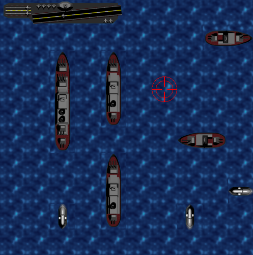

# BATTLESHIP



## Usage

```text
./battleship.py

```

## Controls

- Cursor keys/mouse: move crosshair
- Enter/left click: fire
- Escape: Quit
- N: New game

## Download

Find and download the directory for your system in the [dist folder](./dist/). It contains an executable and all required resources.

## Requirements

- Python 3
- PyGame
- pgu

## Licensing

You may use this code however you wish but you'll have to keep the license terms the same.

Graphics by Fabian Freiesleben.

pgu is licensed under LGPL v2.1
